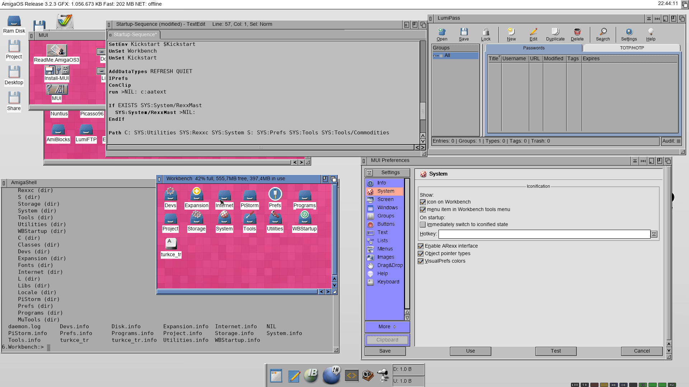

# AAText

Antialiased TrueType text for AmigaOS 3.2 on RTG screens.



*AmigaOS 3.2.3 on PiStorm (Emu68), Picasso96, 1920×1080: Workbench, Shell,
TextEdit, MUI Preferences and LumiPass, all with antialiased TrueType text.*

AAText makes Workbench and applications draw TrueType fonts smoothly: icon
labels, menus, window and screen titles, Shell windows, GadTools, ReAction
and MUI programs — everything that draws text through `graphics.library`.

- **Zero configuration.** Every TrueType or OpenType (CFF) font installed with a font manager
  (a `.otag` file next to the `.font` file) is detected automatically and
  drawn antialiased in every size, using the code page from its `.otag` file.
- **No replaced libraries.** AAText patches `Text()`, and optionally
  `TextLength()`, `TextExtent()` and `TextFit()`, at run time and removes the
  patches cleanly when it quits.
- **Safe metrics by default.** Letters keep the cells of the system's bitmap
  font, so no window layout changes. Optional real metrics mode (`real on`)
  uses the TrueType widths and pair kerning and keeps all measuring functions
  consistent.
- **Preferences program.** AATextPrefs (English and Turkish) changes gamma,
  hinting, the program blacklist and the other settings with a live preview:
  a running AAText takes every change at once.
- Bitmap fonts and palette (AGA) screens are left untouched.

*Türkçe açıklama aşağıda.*

## Requirements

- AmigaOS 3.2 or newer, 68020 or better
- RTG with `cybergraphics.library` (e.g. Picasso96)
- TrueType or OpenType fonts installed with `.otag` files (ttf.library, or
  freetype2.library + FTManager)

Tested on AmigaOS 3.2.3 with WinUAE (UAEGFX) and PiStorm (Emu68).

## Download and installation

Binary releases are on Aminet (`util/wb/AAText.lha`) and on the
[Releases](https://github.com/Sdursun/AAText/releases) page. Copy `AAText` to
`SYS:WBStartup` and reboot; copy `AATextPrefs` (and its icon) to `SYS:Prefs`
if you want the preferences program. The full user guide is in
[docs/AAText_EN.txt](docs/AAText_EN.txt) (Turkish:
[docs/AAText_TR.txt](docs/AAText_TR.txt)); all settings are described in
[docs/AAText.prefs.example](docs/AAText.prefs.example).

## Building

AAText is cross-compiled with [bebbo's amiga-gcc](https://codeberg.org/bebbo/amiga-gcc)
in Docker; on Windows the scripts are PowerShell.

```sh
sh tools/fetch-freetype.sh      # FreeType 2.14.3 into third_party/ (sha256 checked)
.\build.ps1                     # build/68020/AAText
.\build.ps1 DEBUG=1             # build/68020-debug/AAText (serial kprintf output)
.\build.ps1 CPU=68060           # build/68060/AAText
.\build.ps1 gui                 # build/68020/AATextPrefs
.\build.ps1 catalogs icons      # Turkish catalog and GlowIcon (build/catalogs, build/icons)
.\build.ps1 dist                # build/dist/AAText.lha + AAText.readme
```

On Linux or macOS, run `make` inside the container directly:

```sh
docker run --rm -v "$PWD:/src" -w /src ghcr.io/rondoval/amiga-build-container make
```

### Tests

The glyph, `.otag`, metrics and cache code is pure enough to run under the
[vamos](https://github.com/cnvogelg/amitools) AmigaOS emulator:

```sh
sh tools/fetch-testfonts.sh     # DejaVu fonts for tests/test.prefs
.\test.ps1 Ag                   # builds tools/vamos image on first use
```

See `tests/fttest.c` for the test modes (`metrics`, `stress`, `auto`,
`otag`, `baseline`, `capsize`).

### Source overview

| File | Purpose |
|---|---|
| `src/main.c` | startup, arguments, helper loop that loads fonts |
| `src/patch.c`, `src/stub.s` | `SetFunction()` patches, safe removal, reentrancy guard |
| `src/render.c` | decides per `Text()` call; antialiased read-modify-write drawing, 1 bit fallback |
| `src/glyphs.c` | FreeType faces, automatic detection, LRU glyph cache, private render stack |
| `src/metrics.c` | `TextLength`/`TextExtent`/`TextFit` for real metrics mode |
| `src/otag.c` | `.otag` file parser |
| `src/prefs.c` | settings file parser |
| `src/aamsg.h`, `src/aaclient.c` | message port interface of a running AAText (RELOAD, APPLY, STATUS) |
| `src/prefswrite.c` | writes the settings file, keeping comments and font mappings |
| `src/prefsgui/` | AATextPrefs (ReAction); strings in `strings.h`, Turkish in `catalogs/turkish.ct` |
| `tools/mkcatalog.pl`, `tools/mkicon.py` | locale catalog and GlowIcon builders (`icons/` holds the icon art) |
| `src/ft/` | minimal FreeType configuration and exec memory pool allocator |

## License

AAText is released under the [MIT License](LICENSE): you may use it for any
purpose, commercial or not, as long as the copyright notice (attribution to
the author) is kept.

Exceptions and third-party code:

- `src/metrics.c` is derived from AROS (`rom/graphics/textextent.c`,
  `textfit.c`), Copyright © 1995-2026 The AROS Development Team, and is
  distributed under the [AROS Public License 1.1](LICENSE.APL). Its header
  lists the changes made.
- Binary releases contain FreeType 2.14.3. This software is based in part
  on the work of the FreeType Team. Portions of this software are copyright
  © 2026 The FreeType Project (https://freetype.org). All rights reserved.
  FreeType itself is not part of this repository; `tools/fetch-freetype.sh`
  downloads the unmodified release.

---

## Türkçe

AAText, AmigaOS 3.2'de RTG ekranlarda TrueType fontların yumuşatılmış
(antialiased) çizilmesini sağlar: ikon etiketleri, menüler, pencere ve ekran
başlıkları, Shell pencereleri, GadTools, ReAction ve MUI programları.

- **Ayar gerektirmez.** Sistemde kurulu her TrueType font `.otag` dosyasından
  otomatik bulunur ve her boyutta, doğru kod sayfasıyla (Türkçe dahil) çizilir.
- **Hiçbir kütüphanenin yerine geçmez.** Çalışırken `graphics.library`
  fonksiyonlarını yamalar, kapatıldığında temizce kaldırır.
- **Ayar programı.** AATextPrefs (Türkçe ve İngilizce) gamma, hinting, kara
  liste ve diğer ayarları canlı önizlemeyle değiştirir; çalışan AAText her
  değişikliği hemen uygular.
- Bitmap fontlara ve paletli (AGA) ekranlara dokunmaz.

**Kurulum:** `AAText` dosyasını `SYS:WBStartup` içine kopyalayıp sistemi
yeniden başlatın; ayar programı için `AATextPrefs` dosyasını (ikonuyla)
`SYS:Prefs` içine kopyalayın. Ayrıntılı kullanım kılavuzu:
[docs/AAText_TR.txt](docs/AAText_TR.txt).

**Lisans:** [MIT](LICENSE). Ticari ya da ticari olmayan her amaçla
kullanılabilir, değiştirilebilir ve dağıtılabilir; tek şart telif satırının
(geliştiriciye atfın) korunmasıdır. İstisna: `src/metrics.c` AROS'tan
türetilmiştir ve [AROS Public License 1.1](LICENSE.APL) kapsamındadır.
FreeType'a ait atıf yukarıdaki İngilizce bölümde.

**Hata bildirimi ve öneriler:** [Issues](https://github.com/Sdursun/AAText/issues)
